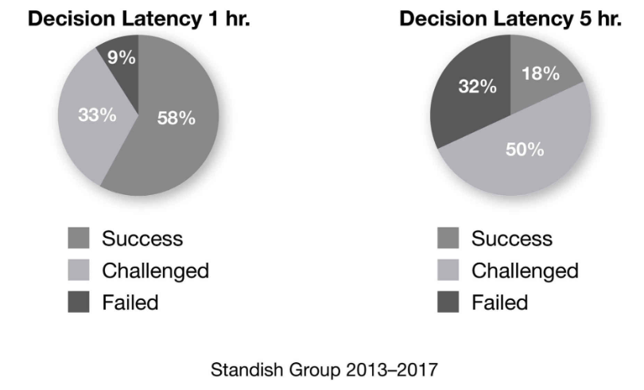

+++
title = "Decision Latency"
weight = 20
+++

> [!ressource] Ressource
> The Scrum Fieldbook p40 à 45

> So he started adding the question “How fast do you make decisions?” to his research. And when he looked at the projects that had problems, he realized that it wasn’t an aberration, it was commonplace. **In projects that failed, people simply weren’t making decisions.**

Une prise de décision rapide, permet d'augmenter significativement la réussite d'un projet.

> Most of those decisions are trivial and easy. But if you have a rigid, hierarchical process where decisions have to go up the chain to be approved and then flow back down, that journey takes a long time.

## Votre organisation impacte la prise de décision
- Dans une organisation *Pathological* la prise de décision sera plus lente que lorsqu'elle est ouvertement partagée (*Generative* organisation)
- Le taux de [Psychological Safety]() impactera également de délais et la qualité des décisions

=> Il est donc important de créer un environnement qui favorise la prise de décision. Par exemple avec Scrum

### Comment Scrum résout ce problème ?

Scrum délègue la prise de décision au niveau de l'équipe. Il n'y a en réalité que deux décideurs : 
- le Product Owner 
- et l'équipe

C'est la clé. **Seules les personnes qui ont réellement le plus de connaissances et qui comprennent le mieux le sujet devraient prendre la décision**. Et c'est ainsi que vous pouvez agir rapidement. Si la prise de décision prend plus d'une demi-journée, c'est presque certainement le signe que vous avez dû la transmettre à vos supérieurs pour approbation.